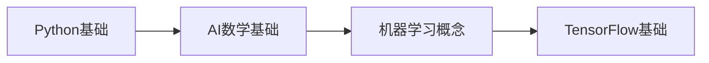
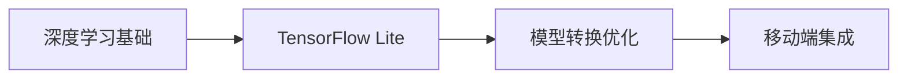
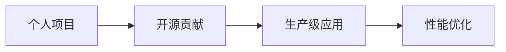

# 🚀 AI学习路线指南 - 从Android开发到AI工程师

> 专为有经验的移动开发者设计的AI转型路线图

## 📋 目录
- [🎯 学习目标](#-学习目标)
- [🛣️ 学习路线图](#️-学习路线图)
- [📚 阶段详解](#-阶段详解)
- [🛠️ 工具与环境](#️-工具与环境)
- [🔬 实践项目](#-实践项目)
- [📖 学习资源](#-学习资源)
- [🎯 职业发展](#-职业发展)
- [💡 学习建议](#-学习建议)

## 🎯 学习目标

### 短期目标（3个月）
- 掌握TensorFlow Lite在Android端的集成与部署
- 理解深度学习基础概念和 workflow
- 完成2-3个完整的移动端AI应用

### 中期目标（6个月）
- 具备自定义模型训练和优化能力
- 掌握模型转换和移动端性能优化
- 参与开源AI项目贡献

### 长期目标（1年）
- 成为移动AI领域专家
- 具备端到端AI解决方案能力
- 向AI架构师或技术负责人发展

## 🛣️ 学习路线图

### 阶段一：基础入门（1-2个月）


### 阶段二：核心技术（2-3个月）


### 阶段三：项目实战（2-3个月）


## 📚 阶段详解

### 🥇 阶段一：AI基础奠基

#### 1.1 Python编程基础
```python
# 重点掌握：
# - 基础语法和数据结构
# - NumPy数组操作
# - Pandas数据处理
# - Matplotlib数据可视化

import numpy as np
import pandas as pd
import matplotlib.pyplot as plt

# 实践项目：数据分析和可视化脚本
```

#### 1.2 AI数学基础
- **线性代数**: 矩阵运算、向量空间
- **概率论**: 概率分布、贝叶斯定理
- **微积分**: 导数、梯度、优化

#### 1.3 机器学习概念
- 监督学习 vs 无监督学习
- 训练/验证/测试集划分
- 过拟合与欠拟合
- 评估指标（准确率、精确率、召回率）

### 🥈 阶段二：深度学习入门

#### 2.1 神经网络基础
- 神经元和激活函数
- 前向传播与反向传播
- 损失函数和优化器

#### 2.2 TensorFlow/Keras实战
```python
# 经典入门项目：MNIST手写识别
model = tf.keras.Sequential([
    tf.keras.layers.Flatten(input_shape=(28, 28)),
    tf.keras.layers.Dense(128, activation='relu'),
    tf.keras.layers.Dense(10, activation='softmax')
])

model.compile(optimizer='adam',
              loss='sparse_categorical_crossentropy',
              metrics=['accuracy'])
```

#### 2.3 计算机视觉基础
- 卷积神经网络（CNN）
- 图像分类、目标检测
- 数据增强技术

### 🥉 阶段三：移动端AI集成

#### 3.1 TensorFlow Lite精通
```java
// Android端集成
public class ImageClassifier {
    private Interpreter tflite;
    
    public void loadModel() {
        tflite = new Interpreter(loadModelFile());
    }
    
    public float[] classify(Bitmap bitmap) {
        // 预处理 + 推理 + 后处理
    }
}
```

#### 3.2 模型转换与优化
```python
# 模型转换流程
converter = tf.lite.TFLiteConverter.from_keras_model(model)
converter.optimizations = [tf.lite.Optimize.DEFAULT]
tflite_model = converter.convert()
```

#### 3.3 性能优化技巧
- 模型量化（FP16, INT8）
- 操作符兼容性处理
- 内存和功耗优化

## 🛠️ 工具与环境

### 开发工具栈
| 工具类型 | 推荐选择 | 用途 |
|---------|----------|------|
| **Python IDE** | PyCharm, VS Code | 模型开发和训练 |
| **移动IDE** | Android Studio | 应用集成 |
| **版本控制** | Git + GitHub | 代码管理 |
| **实验管理** | TensorBoard, Weights & Biases | 训练监控 |

### 环境配置
```bash
# 基础环境
pip install tensorflow==2.13.0
pip install numpy pandas matplotlib jupyter

# 移动端相关
pip install tflite-support
```

## 🔬 实践项目

### 入门项目
1. **MNIST手写识别App**
   - 技术栈: TensorFlow Lite + Android CameraX
   - 学习重点: 基础集成流程

2. **图像分类器**
   - 技术栈: 迁移学习 + TFLite
   - 学习重点: 模型转换优化

### 进阶项目
3. **实时物体检测**
   - 技术栈: SSD MobileNet + Camera2 API
   - 学习重点: 性能优化

4. **智能相册**
   - 技术栈: 多模型集成 + MediaStore
   - 学习重点: 工程架构

### 高级项目
5. **AI健身教练**
   - 技术栈: MediaPipe + 姿态估计
   - 学习重点: 复杂AI pipeline

6. **离线翻译器**
   - 技术栈: Transformer + TFLite
   - 学习重点: 序列模型部署

## 📖 学习资源

### 官方文档
- [TensorFlow官方文档](https://tensorflow.google.cn/)
- [TensorFlow Lite指南](https://tensorflow.google.cn/lite)
- [Android ML Kit文档](https://developers.google.cn/ml-kit)

### 推荐课程
1. **吴恩达《机器学习》** - Coursera
2. **TensorFlow官方认证** - 开发者认证
3. **Google ML Bootcamp** - 实战训练营

### 书籍推荐
- 《动手学深度学习》 - 李沐
- 《Python机器学习基础教程》 - Andreas Müller
- 《TinyML》 - Pete Warden

### 社区资源
- **TensorFlow中文社区**
- **GitHub开源项目**
- **Kaggle竞赛平台**

## 🎯 职业发展

### 技能矩阵
| 技能领域 | 入门 | 熟练 | 专家 |
|---------|------|------|------|
| Python编程 | ✅ | 🎯 | 🚀 |
| 深度学习 | ✅ | 🎯 | 🚀 |
| 移动开发 | 🚀 | 🚀 | 🚀 |
| 模型部署 | ✅ | 🎯 | 🚀 |
| 性能优化 | ✅ | 🎯 | 🚀 |

### 职业路径
1. **移动AI工程师** - 专注移动端AI集成
2. **AI应用工程师** - 全栈AI解决方案
3. **AI算法工程师** - 深入算法研发
4. **技术负责人** - 团队管理和架构设计

## 💡 学习建议

### 时间管理
```python
# 推荐每日学习计划
daily_schedule = {
    "早晨": "理论学习(30min)",
    "通勤": "技术播客/视频",
    "晚上": "编码实践(90-120min)", 
    "周末": "完整项目实践"
}
```

### 学习法则
1. **二八原则**: 20%理论 + 80%实践
2. **项目驱动**: 每个阶段完成可展示的项目
3. **持续迭代**: 定期复习和知识整理
4. **社区参与**: 积极提问和分享

### 避免的陷阱
- ❌ 只看不练
- ❌ 盲目追求新技术
- ❌ 忽视基础知识
- ❌ 单打独斗不交流

### 成功习惯
- ✅ 每日代码提交
- ✅ 每周技术总结
- ✅ 每月项目复盘
- ✅ 参与开源贡献

## 🎉 开始你的AI之旅！

**记住你的优势**：十年Android开发经验让你对移动平台有深刻理解，这是很多AI研究者不具备的宝贵资产。移动端AI开发不仅需要算法知识，更需要工程实现能力。

**下一步行动**：
1. 配置开发环境
2. 完成第一个MNIST项目
3. 加入AI技术社区
4. 开始构建个人作品集

---

> **💪 转型不是重新开始，而是让经验与新技术融合产生化学反应**
> 
> **📅 开始日期: {当前日期}**
> **🎯 目标达成: 1年内成为移动AI专家**

---
*最后更新: {当前日期}*  
*维护者: [你的名字]*  
*License: MIT*